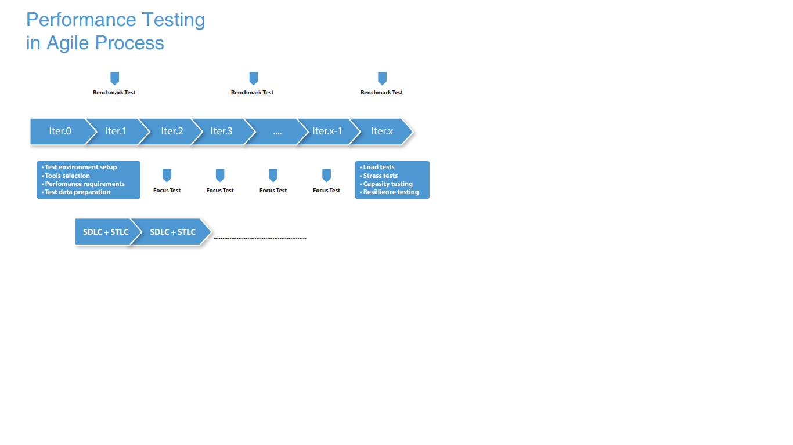

# Contents

- [Glossary](#glossary)
- [Levels of Performance Testing](#glossary)
  - [How to build](#how-to-build)
  - Build requirements](#build-requirements)
  - [How to build](#how-to-build)
- [Types of Performance Test](#Types of Performance Test)
  - [Build requirements](#build-requirements)
  - [How to build](#how-to-build)
  - Build requirements](#build-requirements)
  - [How to build](#how-to-build)
  - Build requirements](#build-requirements)
  - [How to build](#how-to-build)

# Glossary
#Levels of Performance Testing

