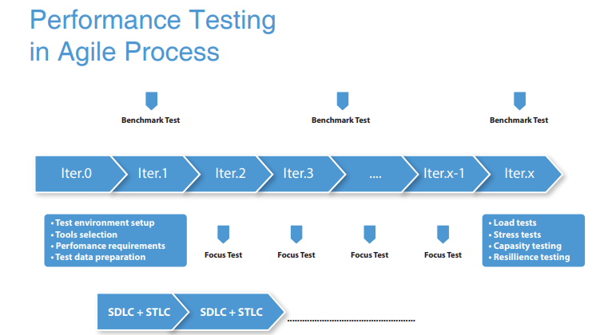

- ## Performance Testing in Agile Process
     
 The main reason of point and the advantage of doing the performance testing in agile process is to save time factor and to have performance testing in early life cycle of          SDLC .Performance testing is one of the single biggest catalysts to significant changes in architecture, code, hardware and environments. Performance testing in an agile          project environment allows to manage the testing in a highly flexible way and Iterative testing approach leads to better code that is optimized for performance.Thus,to            performance test the available code, analyze and fix performance bottlenecks as soon as the code/componet is ready is inevitable.

     
     
     
- ## Levels of Performance Testing
  - **Unit Code Level**   :Performance testing of individual methods
  - **Component Level**   :Performance testing of Individual component/service 
  - **Application Level** :Performance testing of critical application flows 
 
-  ## Performance Testing Types
      - **Load Testing**– Performance test is conducted with anticipated user loads. 
      - **Stress Testing** – Performance test is conducted with wirth extreme workloads to see how it handles high traffic or data processing. 
      - **Endurance Testing** – Performance test is conducted to make sure the software can handle the expected load over a long period of time.  
      - **Spike Testing** – It is used to test the software’s reaction to sudden large spikes in the load generated by users.
      - **Volume Testing** – Here, a large amount of data is populated in a database and the overall software system’s behavior is monitored. 

