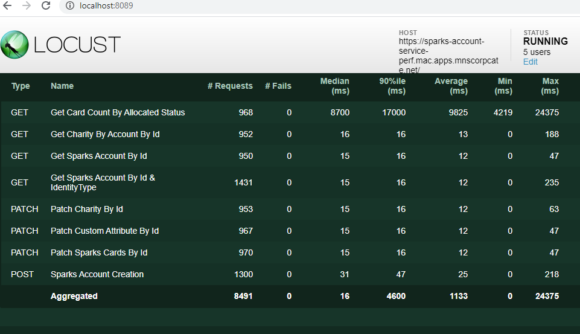
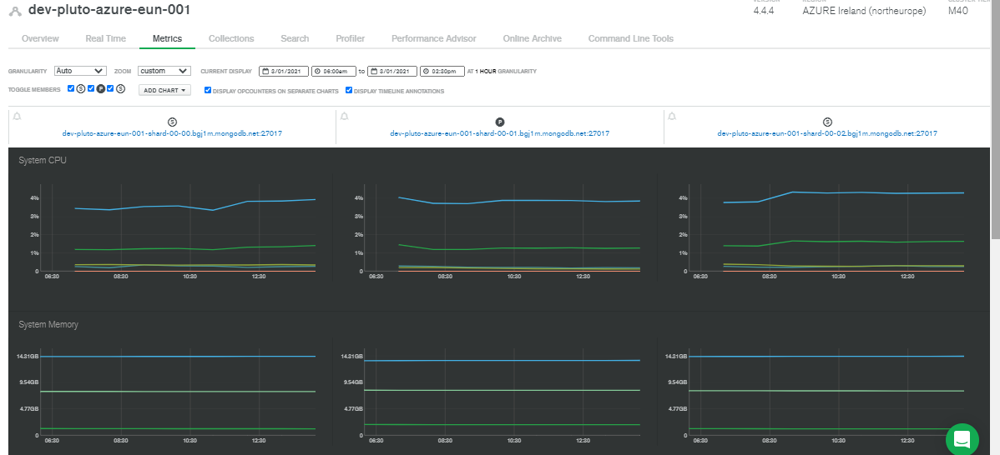
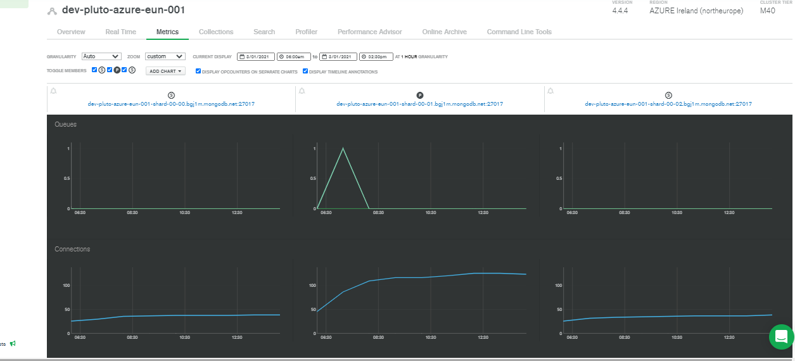

- ## Summary
    - Test Name :
    - Test Objective :
    - Code Buid :
    - Date and Time :
    - Observations :
    - RAG Status :
    - PT Bug (if any) : 
    - NFR's : [Test NFR](PT_Template_NFR-API.md) [ Provide link to the link to the Test NFR's .md file]
    
 - ## Application-side Metrics
   - ### API Response Time and TPS:
        - #### API Name:
            -  Pass count:
            -  Fail count:
            -  TPS:
            -  Average Response Time:
            -  Median Response Time:
            -  90% Response Time:
            -  Status : Pass/ Fail [compare the API test result with NFR and state whether the it has passed or failed.]
             
        - #### API Name:
            -  Pass count:
            -  Fail count:
            -  TPS:
            -  Average Response Time:
            -  Median Response Time:
            -  90% Response Time:
            -  Status : Pass/ Fail [compare the API test result with NFR and state whether the it has passed or failed.]

      
        
   - ### Response Time Summary :  
        [sample image given below]
     
        
       
  - ## Server-side Metrics 

    - ### Application Server  :
       - NewRelic Dashboard - [NewRelic Dashboard Link](https://gorgon.nr-assets.net/image/c86c9d96-7d80-4fe2-b80a-f31de816030a?format=pdf) 
       
       [ Account service Dashboard given for reference.Add observations on CPU,Memory and JVM utilisation of Pods.]
 
    - ### Database Server :
      - CPU and Memory : [Sample image given below.Add observations on CPU and Memory utilisation.]
      
      
      
      - DB Connections and Queues : [Sample image given below. Add observations on DB connections and Queues behaviour]. 
     
      
      
   
