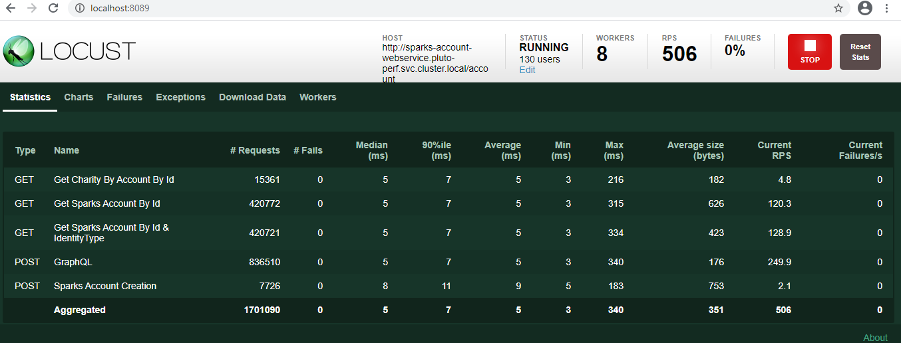
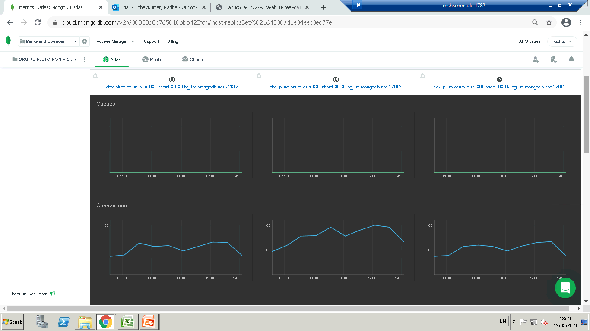

- ## Summary
    - Test Name :Account Services _Peak Test
    - Test Objective : The test objective is to simulate peak load for the 4 REST API's [Get Charity by Account ID, Get Sparks Account by ID, Get Sparks Account by ID &Identity Type,Sparks Account Creation ]and 1 GraphQL API in Locust POD to POD  [Locut Test Pod to Account Services Pod ] using the cluster end point http://sparks-account-webservice.pluto-perf.svc.cluster.local/account
    - Code Buid :
    - Date and Time : 17-Mar-2021 - 08:03:07 - 17-Mar-2021 - 08:59:27
    - Observations :  The 90% response time for Sparks Account Creation was 11 ms seconds and for all other API's it was less than 6 ms.506 TPS was achieved during the Peak load Test execution. The DB and Account Services CPU utilisation were less than 15%.
    - RAG Status : GREEN
    - PT Bug (if any) : N/A
    - NFR's : [Test NFR](PT_Template_NFR-API.md) [ Provide link to the Test NFR's .md file]
    
 - ## Application-side Metrics
   - ### API Response Time and TPS:
        - #### API Name:
            -  Pass count:
            -  Fail count:
            -  TPS:
            -  Average Response Time:
            -  Median Response Time:
            -  90% Response Time:
            -  Status : Pass/ Fail [compare the API test result with NFR and state whether the it has passed or failed.]
             
        - #### API Name:
            -  Pass count:
            -  Fail count:
            -  TPS:
            -  Average Response Time:
            -  Median Response Time:
            -  90% Response Time:
            -  Status : Pass/ Fail [compare the API test result with NFR and state whether the it has passed or failed.]

      
        
   - ### Response Time Summary :  
        
        
       
  - ## Server-side Metrics 

    - ### Application Server  :
       - NewRelic Dashboard - [NewRelic Dashboard Link](https://gorgon.nr-assets.net/image/8a70c53e-1c72-432a-ab30-2ea4da1cb47a?format=PDF) 
       
       [ Account service Dashboard given for reference.Generate the PDF link and provide here .Add observations on CPU,Memory and JVM utilisation of Pods.]
 
    - ### Database Server :
      - CPU and Memory : [Sample image given below.Add observations on CPU and Memory utilisation.]
      
      
      
      - DB Connections and Queues : [Sample image given below. Add observations on DB connections and Queues behaviour]. 
     
      
      
   
